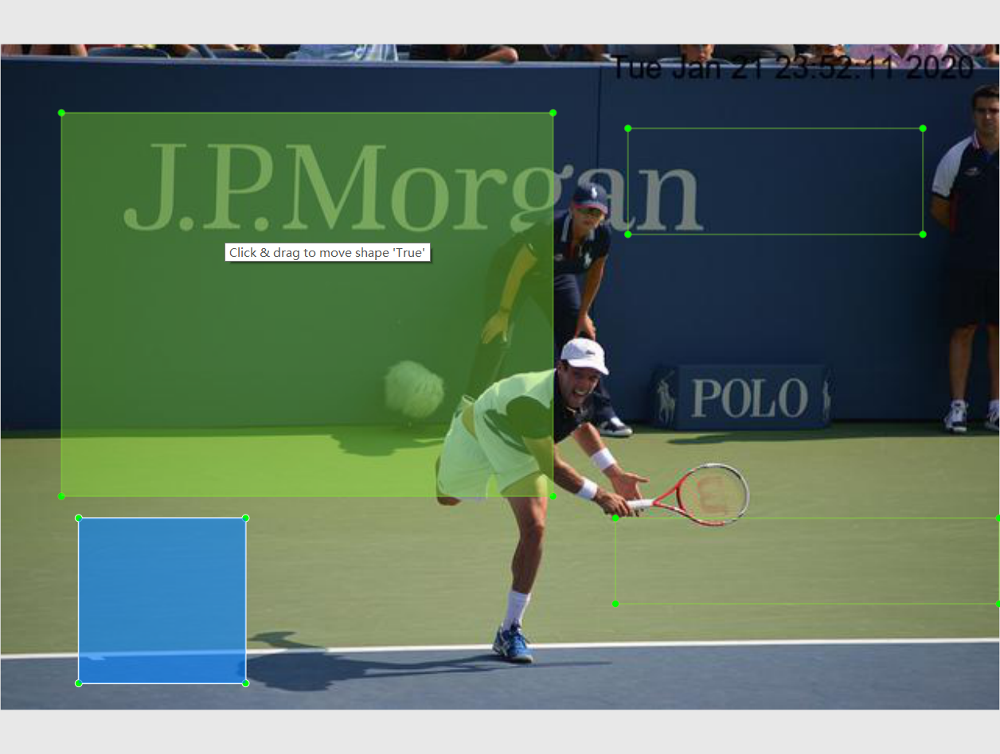
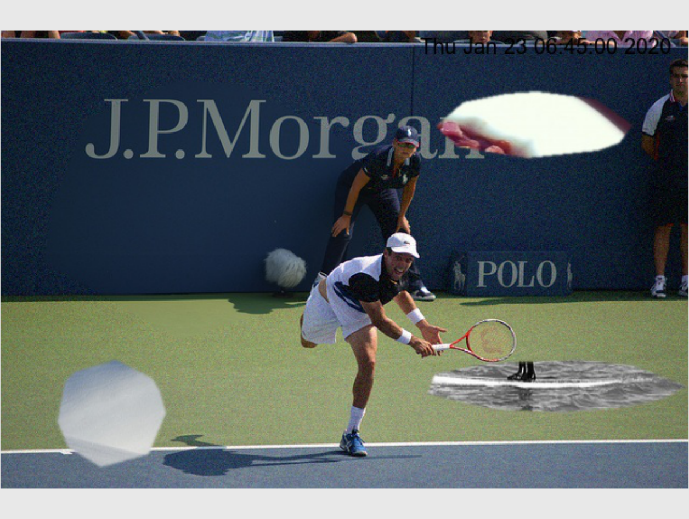

图片路径什么的都没改，代码替换了应该可以直接运行

可看最近的commit历史，都是按顺序加上去的

https://github.com/mooooon333/generate_data


图片张数必须比364多？


## 主要改变：

utils可选多边形模式和边缘模糊

```python
def release_difference(A,img_path,xml_path,copy_path,iter_array,rotation,anchor,area,subfix,mode = 1,margin_blur = True):
    '''
    Parameters
    - mode: 生成图片的模式
        - 0: 矩形贴图
        - 1: 多边形贴图
    - margin_blur: 边缘模糊
    '''
```


四角添加时间在rename上

```python
# word 是否四角添加时间
def imgs_rename(imgs_path,xml_path,copy_path,w_h_ratio,s_ratio,rotation=[0,math.pi/4,math.pi/2,3*math.pi/4],
                anchor_ratio=[1,2,3,5,7],area=[0.05,0.25,0.5],word = True):
```


## 多边形

多边形方法参考的第二个回答（可以根据这些参数调节多边形形状）


https://stackoverflow.com/questions/8997099/algorithm-to-generate-random-2d-polygon

修改的地方是根据椭圆参数方程可以将基于圆改为基于椭圆以适应之前设置的长宽比

但是多边形还是在矩形旋转后生成的那个框内贴合创建的


所以有一个问题是不知道面积符不符合之前的设置

而且还有一个问题是这样都是横的或者竖的...可以直接用PIl的rotate方法，然后要重新生成框，关键是不知道之前的设置的rotate是什么意思，所以先没转


多边形由于最后spikeyness原因可能和之前框不符合，所以修正了一下框


## 边缘模糊

对多边形和矩形都有效


边缘模糊的值设为5，模糊效果如图，打榜时试验情况不太好

最后设成了肉眼不太可见的

## Todo：

Debug：有些地方有框，但是没有贴图？？不知道什么原因？

按道理我这里加的应该不会影响这个






