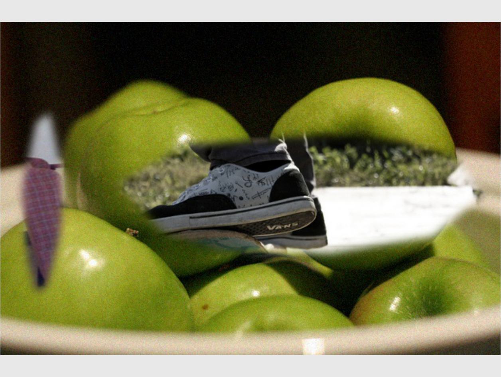

图片张数必须必364多？

图片贴上之前裁剪，然后加点模糊

调一下vscode的python调试

多边形参考了第二个回答

https://stackoverflow.com/questions/8997099/algorithm-to-generate-random-2d-polygon

根据椭圆参数方程改半径公式可以创建椭圆的效果，但问题是这样椭圆的半径都是横的或者竖的，再转的话这个不太懂

用acons theta b sin theta

边缘模糊的值设为5，模糊效果如图，试验情况不太好

有问题：有些地方有框，但是没有贴图？？没贴图这个是什么原因？？

问题：spikyness大的时候可能会超出框外，所以两边都缩小一点，最后再用pil的方法裁剪一下边

多边形要再旋转一下的话后续可以用PIl的rotate函数，不过框要重新生成

现在啊多边形稍有超出或者稍短一点，也是要重新生成框来更好的匹配

多边形面积是个问题，原来的面积和多边形面积